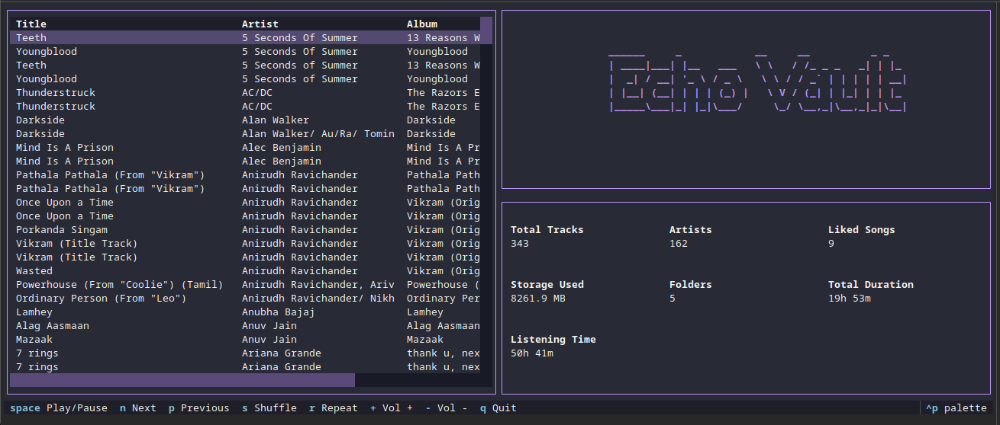
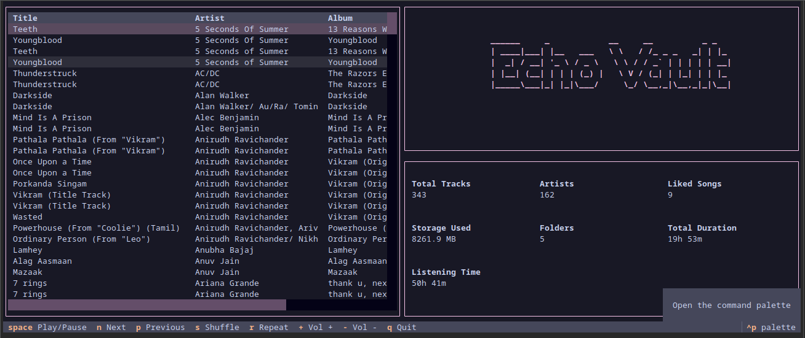

# EchoVault

[](https://pypi.org/project/echovault)
[](https://pypi.org/project/echovault)

-----

## Table of Contents

- [Installation](#installation)
- [License](#license)

## Installation

```console
pip install EchoVault-CLI
```

## CLI Preview

- 

- 

## License

`echovault` is distributed under the terms of the [MIT](https://spdx.org/licenses/MIT.html) license.
